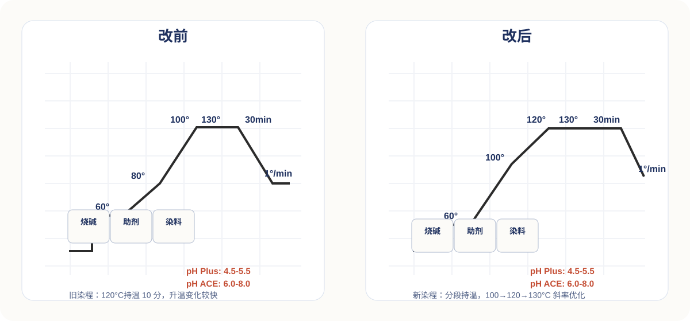

<section class="report-slide">
  

    

      
染色異常處理報告

      

        

          <h1 class="cover-title">異常工卡進度匯報</h1>
          
AD 異常清單 · 15 項工卡進度追蹤

          

          

            

              
報告範圍

              
工卡異常分析 · 配方調整 · 進度追蹤

            

            

              
匯報日期

              
2026 年 6 月 12 日

            

          

        

        <aside class="metric-card">
          
總項目數

          
15

          
項異常工卡

        </aside>
      

      

        染整制程改善小组
        内部资料
      

    

  

</section>

---

<section class="report-slide">
  

    

      <header class="report-header">
        

          
色樣狀態明細

          <h2 class="report-title">15 項工卡色樣狀態分類</h2>
        

        
02 / 24

      </header>
      

        <article class="status-column">
          

            染色完成 · 測試
            6
          

          

            

              
工卡 2650014700

              
AJ3B · D65 Pass

            

            

              
工卡 2650015060

              
ADFY · 接近 Pass

            

            

              
工卡 2650016870

              
AEDA · Fail 偏深

            

            

              
工卡 2650015070

              
AEDE · Warn 偏淡

            

            

              
工卡 2650015090

              
AA2U · Fail 重调

            

            

              
工卡 2650015100

              
AE65 · Fail 偏蓝

            

          

        </article>
        <article class="status-column">
          

            持續調整中
            7
          

          

            

              
工卡 2650014570

              
AJ34 · 色差 70005795

            

            

              
工卡 2650014740

              
ABZQ · 色差 2650014740

            

            

              
工卡 2650022880

              
AETF · 色差 70030349

            

            

              
工卡 2650015050

              
ABZQ · 色差 70031872

            

            

              
工卡 2650016880

              
AETF · 色差 70035249

            

            

              
工卡 2610043870

              
AJ34 · 色差 70038437

            

            

              
工卡 2610047320

              
AJ3B · 色差 70038437

            

          

        </article>
        <article class="status-column">
          

            顏色 OK 待排缸
            2
          

          

            

              
工卡 2650014710

              
ADEY · 布号 70021420

            

            

              
工卡 2650015080

              
AJ3B · 布号 70036670

            

          

        </article>
      

      
彙總：6 項大貨完成（Data Color）／2 項顏色 OK 待排缸下週／7 項持續調整中

    

  

</section>

---

<section class="report-slide">
  

    

      <header class="report-header">
        

          
改善方案明細

          <h2 class="report-title">三大類改善方向 ｜ 染料 · 助劑 · 染程</h2>
        

        
03 / 24

      </header>
      

        <article class="plan-card">
          
01

          <h3>染料替换</h3>
          

            
Rubine XF（旧染料） <b>→ 1224 Deep Red HW-SFN BS</b>

            
Navy DXF-02（跳灯严重） <b>→ Navy Blue HWE 300% BS</b>

            
Yellow XF2 <b>→ Yellow S-GLS BS（新染料）</b>

            
Orange 1515 <b>→ Yellow GLS</b>

            
Rubine XF <b>→ Dianix Rubine XFS</b>

          

        </article>
        <article class="plan-card plan-card--amber">
          
02

          <h3>助剂调整</h3>
          

            
TX 0.3 g/L（用量不足） <b>→ TX 0.9 ~ 1.0 g/L（提高匀染）</b>

            
CELPOM 640（旧助剂） <b>→ CPX 2 g/L（新助剂）</b>

            
无 PAB <b>→ 新增 PAB 3 g/L</b>

          

        </article>
        <article class="plan-card plan-card--blue">
          
03

          <h3>染程优化</h3>
          

            
旧染程（无持温） <b>→ 120°C 持温 10 分</b>

            
快速升温（色花风险） <b>→ 60→100°C 持温 10 分 斜率 1</b>

            
升温过快 <b>→ 100→120°C 持温 10 分 斜率 0.8</b>

            
常规终温 <b>→ 120→130°C 斜率 0.8</b>

            
pH 控制 <b>→ 前后 pH 差异 ≤ 0.5 / 4.5-5.5</b>

          

        </article>
      

      

        改善方向覆蓋染料／助劑／染程三大維度
        適用於高 OP 染色及跳燈優化
      

    

  

</section>

---

<section class="report-slide">
  

    

      <header class="report-header">
        

          
改善方案明細

          <h2 class="report-title">三大類改善方向 ｜ 染料 · 助劑 · 染程</h2>
        

        
04 / 24

      </header>
      

        

          
        

        <aside class="process-card">
          <h3>03 染程優化</h3>
          <ul>
            <li>旧染程（无持温） → <b>120°C 持温 10 分</b></li>
            <li>快速升温（色花风险） → <b>60→100°C 持温 10 分 斜率 1</b></li>
            <li>升温过快 → <b>100→120°C 持温 10 分 斜率 0.8</b></li>
            <li>常规终温 → <b>120→130°C 斜率 0.8</b></li>
            <li>pH 控制 → <b>前后 pH 差异 ≤ 0.5 / 4.5-5.5</b></li>
          </ul>
        </aside>
      

      

        改前／改後對照
        適用於高 OP 染色及跳燈優化
      

    

  

</section>

---

<section class="report-slide">
  

    

      <header class="report-header">
        

          
01 工卡异常跟踪

          <h2 class="report-title">工卡 2610013500 · AJ34</h2>
        

        
05 / 24

      </header>
      

        

          <h3>工卡基本信息</h3>
          

            

工卡号

2610013500

            

布号

70005795

            

颜色代码

AJ34

            

异常类别

色差

            

成分

88% 再生聚酯 / 12% 氨纶

            

当前状态

进行中

          

          

            进行中
            Item 01 of 15 · 2026/05
          

        

        

          

            <h3>进度跟踪</h3>
            

              

05/09

缩练定型完成

              

05/12

化验室染色

              

05/18

复色

              

05/21

颜色太红，继续调整

              

05/22

更换染料配方组合

              

05/25

收到新染料

            

          

          

            <h3>改善措施</h3>
            <ul class="action-list">
              <li>更换为 Brill.Violet BB + Violet HWBF + Navy Blue HW-LE 组合</li>
              <li>TX 0.6 / 640 → CPX 2g / PAB 3g</li>
              <li>pH 4.5-5.5</li>
            </ul>
          

        

      

    

  

</section>

---

<section class="report-slide">
  

    

      <header class="report-header">
        

          
02 工卡异常跟踪

          <h2 class="report-title">工卡 2650014700 · AJ3B</h2>
        

        
06 / 24

      </header>
      

        

          <h3>工卡基本信息</h3>
          

            

工卡号

2650014700

            

布号

70016834-S4

            

颜色代码

AJ3B

            

异常类别

色差

            

成分

88% 再生聚酯 / 12% 弹性纤维

            

当前状态

染完 OK · D65 Pass

          

          

            染完 OK · D65 Pass
            05/31 现场染色完 · Data Color 测试
          

        

        

          

            <h3>进度跟踪</h3>
            

              

05/09

缩练定型完成

              

05/12

化验室染色

              

05/18

等确认蓝色染料

              

05/21

颜色不够红

              

05/23

颜色 OK

              

05/27

预计染色

            

          

          

            <h3>改善措施</h3>
            <ul class="action-list">
              <li>原配方染料调整</li>
              <li>TX 0.3 → 0.9 g/L</li>
              <li>新增 PAB 3 g/L</li>
              <li>640 改 CPX 2 g/L（新助剂）</li>
            </ul>
          

          

            <h3>5/31 大货 vs Lab</h3>
            

              

DE

0.58 / 0.65

              

CMC

0.45 / 0.51

              

MI

0.11

              

力度

104.38%

            

          

        

      

    

  

</section>

---

<section class="report-slide">
  

    

      <header class="report-header">
        

          
03 工卡异常跟踪

          <h2 class="report-title">工卡 2650014710 · ADEY</h2>
        

        
07 / 24

      </header>
      

        

          <h3>工卡基本信息</h3>
          

            

工卡号

2650014710

            

布号

70021420

            

颜色代码

ADEY

            

异常类别

色差

            

成分

56% 棉 / 40% 再生聚酯 / 4% 弹性纤维

            

当前状态

颜色 OK · 待排缸

          

          

            颜色 OK · 待排缸
            05/26 厂商新配方试色 OK · 06/02 排缸
          

        

        

          

            <h3>进度跟踪</h3>
            

              

05/09

缩练定型完成

              

05/12

化验室酵素洗 + 染色

              

05/18

打色中

              

05/21

等确认配方，原配方浓度成本过高

              

05/25

厂商提供新配方进行复色

            

          

          

            <h3>改善措施</h3>
            <ul class="action-list">
              <li>T 配方取消，改用 C 配方</li>
              <li>Synozol Ultra Yellow / Wine / Navy DS</li>
              <li>待大货验证 C 配方稳定性</li>
            </ul>
          

        

      

    

  

</section>

---

<section class="report-slide">
  

    

      <header class="report-header">
        

          
04 工卡异常跟踪

          <h2 class="report-title">工卡 25C0051732 · ABZQ</h2>
        

        
08 / 24

      </header>
      

        

          <h3>工卡基本信息</h3>
          

            

工卡号

25C0051732

            

布号

70025603-OP

            

颜色代码

ABZQ

            

异常类别

色差

            

成分

85% 再生聚酯 / 15% 弹性纤维

            

当前状态

调整中

          

          

            调整中
            Item 04 of 15 · 2026/05
          

        

        

          

            <h3>进度跟踪</h3>
            

              

05/10

缩练定型完成

              

05/12

化验室染色

              

05/18

等确认蓝色染料

              

05/21

颜色染出来太差，查黄色设定

              

05/22

换 1310 为 1313 再下缸

              

05/25

继续调色

            

          

          

            <h3>改善措施</h3>
            <ul class="action-list">
              <li>Dianix Yellow Brown XF2 1.18%</li>
              <li>Goldenlon Navy Blue DXF-02 BS 1.36%</li>
              <li>Deep Red HW-SFN 0.052%</li>
            </ul>
          

        

      

    

  

</section>

---

<section class="report-slide">
  

    

      <header class="report-header">
        

          
05 工卡异常跟踪

          <h2 class="report-title">工卡 25C0017651 · AETF</h2>
        

        
09 / 24

      </header>
      

        

          <h3>工卡基本信息</h3>
          

            

工卡号

25C0017651

            

布号

70030349-RP50/72

            

颜色代码

AETF

            

异常类别

色差

            

成分

83% 再生聚酯 / 17% 弹性纤维

            

当前状态

调整中

          

          

            调整中
            Item 05 of 15 · 2026/05
          

        

        

          

            <h3>进度跟踪</h3>
            

              

05/13

化验室染色

              

05/18

等确认蓝色染料

              

05/21

颜色染出来太红

              

05/22

继续调整

              

05/25

继续调

            

          

          

            <h3>改善措施</h3>
            <ul class="action-list">
              <li>ORANGE 1515 → YELLOW GLS</li>
              <li>RUBINE → 1224 Deep Red</li>
              <li>NAVY DXF → HWE 300%</li>
              <li>TX 改 DIS 1g/L，640 → CPX 2G/L，PAB 维持 3G/L</li>
            </ul>
          

        

      

    

  

</section>

---

<section class="report-slide">
  

    

      <header class="report-header">
        

          
06 工卡异常跟踪

          <h2 class="report-title">工卡 2610016331 · ABZQ</h2>
        

        
10 / 24

      </header>
      

        

          <h3>工卡基本信息</h3>
          

            

工卡号

2610016331

            

布号

70031872

            

颜色代码

ABZQ

            

异常类别

色差

            

成分

85% 再生聚酯 / 15% 弹性纤维

            

当前状态

调整中

          

          

            调整中
            Item 06 of 15 · 2026/05
          

        

        

          

            <h3>进度跟踪</h3>
            

              

05/12

缩练定型完成

              

05/13

化验室染色

              

05/18

等确认蓝色染料

              

05/21

颜色染出来太差，查黄色设定

              

05/22

换 1310 为 1313 再下缸

            

          

          

            <h3>改善措施</h3>
            <ul class="action-list">
              <li>Dianix Yellow Brown XF2 1.28%</li>
              <li>EFDISPERSE Rubine XF 0.16%</li>
              <li>Goldenlon Blue DXF-02 BS 1.26%</li>
            </ul>
          

        

      

    

  

</section>

---

<section class="report-slide">
  

    

      <header class="report-header">
        

          
07 工卡异常跟踪

          <h2 class="report-title">工卡 2650015060 · ADFY</h2>
        

        
11 / 24

      </header>
      

        

          <h3>工卡基本信息</h3>
          

            

工卡号

2650015060

            

布号

70033336

            

颜色代码

ADFY

            

异常类别

色差

            

成分

100% 再生聚酯

            

当前状态

染完 OK · 接近 Pass

          

          

            染完 OK · 接近 Pass
            05/31 现场完 · Data Color 测试
          

        

        

          

            <h3>进度跟踪</h3>
            

              

05/09

缩练定型完成

              

05/11

订边完成

              

05/18

打色中

              

05/21

颜色黄一点

              

05/22

颜色 OK

              

05/27

预计染色

            

          

          

            <h3>改善措施</h3>
            <ul class="action-list">
              <li>原配方染料</li>
              <li>TX 0.3 → 0.9 g/L</li>
              <li>640 改 CPX 2 g/L</li>
              <li>PAB 3 g/L，pH 4.5-5.5</li>
            </ul>
          

          

            <h3>5/31 大货 vs Lab</h3>
            

              

DE

0.69 / 0.71

              

CMC

0.50 / 0.51

              

MI

0.03

              

力度

103.67%

            

          

        

      

    

  

</section>

---

<section class="report-slide">
  

    

      <header class="report-header">
        

          
08 工卡异常跟踪

          <h2 class="report-title">工卡 2650016870 · AEDA</h2>
        

        
12 / 24

      </header>
      

        

          <h3>工卡基本信息</h3>
          

            

工卡号

2650016870

            

布号

70035249

            

颜色代码

AEDA

            

异常类别

色花

            

成分

80% 再生聚酯 / 20% 莱卡

            

当前状态

染完 Fail · 偏深 6.59%

          

          

            染完 Fail · 偏深 6.59%
            05/31 现场染完 · Data Color 测试
          

        

        

          

            <h3>进度跟踪</h3>
            

              

05/12

胚布预缩

              

05/13

化验室染色

              

05/18

打色中

              

05/21

颜色 OK

              

05/25

进行染色，追踪染色结果

            

          

          

            <h3>改善措施</h3>
            <ul class="action-list">
              <li>用原配方</li>
              <li>TX：0.9G</li>
              <li>640 → CPX 2G</li>
              <li>PAB 3G</li>
            </ul>
          

          

            <h3>5/31 大货 vs Lab</h3>
            

              

DE

1.15 / 1.12

              

CMC

0.76 / 0.76

              

MI

0.04

              

力度

106.59%

            

          

        

      

    

  

</section>

---

<section class="report-slide">
  

    

      <header class="report-header">
        

          
09 工卡异常跟踪

          <h2 class="report-title">工卡 25C0086791 · AETF</h2>
        

        
13 / 24

      </header>
      

        

          <h3>工卡基本信息</h3>
          

            

工卡号

25C0086791

            

布号

70035249

            

颜色代码

AETF

            

异常类别

色差

            

成分

80% 再生聚酯 / 20% 莱卡

            

当前状态

调整中

          

          

            调整中
            Item 09 of 15 · 2026/05
          

        

        

          

            <h3>进度跟踪</h3>
            

              

05/12

缩练定型完成

              

05/13

化验室染色

              

05/18

等确认蓝色染料

              

05/21

颜色染出来太红

              

05/22

继续调整

              

05/25

继续调整

            

          

          

            <h3>改善措施</h3>
            <ul class="action-list">
              <li>Yellow XF2 → Yellow GLS BS</li>
              <li>Rubine XF → Deep Red HW-SFN BS</li>
              <li>Navy HWE 300% BS</li>
              <li>TX: 0.9G，640 → CPX 2G，PAB 3G</li>
            </ul>
          

        

      

    

  

</section>

---

<section class="report-slide">
  

    

      <header class="report-header">
        

          
10 工卡异常跟踪

          <h2 class="report-title">工卡 2650015070 · AEDE</h2>
        

        
14 / 24

      </header>
      

        

          <h3>工卡基本信息</h3>
          

            

工卡号

2650015070

            

布号

70035409

            

颜色代码

AEDE

            

异常类别

色花

            

成分

80% 再生聚酯 / 20% 弹性纤维

            

当前状态

染完 Warn · 偏淡 -5.30%

          

          

            染完 Warn · 偏淡 -5.30%
            05/31 现场染完 · Data Color 测试
          

        

        

          

            <h3>进度跟踪</h3>
            

              

05/09

缩练定型完成

              

05/11

订边背面（第一次）

              

05/18

正在打色

              

05/21

颜色染出来偏红

              

05/22

颜色偏蓝继续调整

              

05/25

颜色 OK，确认时间跟染

            

          

          

            <h3>改善措施</h3>
            <ul class="action-list">
              <li>RUBINE XF → DIANIX RUBINE XF</li>
              <li>TX: 0.9G</li>
              <li>640 → CPX 2G</li>
              <li>PAB 3G</li>
            </ul>
          

          

            <h3>5/31 大货 vs Lab</h3>
            

              

DE

0.92 / 0.87

              

CMC

0.55 / 0.50

              

MI

0.10

              

力度

94.70%

            

          

        

      

    

  

</section>

---

<section class="report-slide">
  

    

      <header class="report-header">
        

          
11 工卡异常跟踪

          <h2 class="report-title">工卡 2650015080 · AJ3B</h2>
        

        
15 / 24

      </header>
      

        

          <h3>工卡基本信息</h3>
          

            

工卡号

2650015080

            

布号

70036670

            

颜色代码

AJ3B

            

异常类别

色差

            

成分

77% 再生聚酯 / 23% 弹性纤维

            

当前状态

颜色 OK · 待排缸 下周

          

          

            颜色 OK · 待排缸 下周
            05/26 新配方颜色 OK 确认 · 06/02 排缸
          

        

        

          

            <h3>进度跟踪</h3>
            

              

05/09

缩练定型完成

              

05/12

化验室染色

              

05/18

等确认蓝色染料

              

05/21

颜色太红黄

              

05/22

继续调整

              

05/25

继续调

            

          

          

            <h3>改善措施</h3>
            <ul class="action-list">
              <li>RUBINE → 1224 Deep Red</li>
              <li>NAVY BDXF → Navy HWE 300%</li>
              <li>TX 0.3 → 0.6 / CPX 取代 640 / PAB 3G / ECL 1G/L</li>
              <li>RUBINE XFS + TX 1g + BLM-F 0.2g，升温慢，待大货验证</li>
            </ul>
          

        

      

    

  

</section>

---

<section class="report-slide">
  

    

      <header class="report-header">
        

          
12 工卡异常跟踪

          <h2 class="report-title">工卡 2610043870 · AJ34</h2>
        

        
16 / 24

      </header>
      

        

          <h3>工卡基本信息</h3>
          

            

工卡号

2610043870

            

布号

70038437

            

颜色代码

AJ34

            

异常类别

色差

            

成分

93% 再生聚酯 / 7% 氨纶

            

当前状态

进行中

          

          

            进行中
            Item 12 of 15 · 2026/05
          

        

        

          

            <h3>进度跟踪</h3>
            

              

05/18

正在打色

              

05/21

颜色染出来太红

              

05/22

换染料配方组合

              

05/25

收到染料，确认新配方进行复色

            

          

          

            <h3>改善措施</h3>
            <ul class="action-list">
              <li>改组合 1224 Deep Red + 1357 Royal Blue</li>
              <li>1567 Neocron Violet R H/C BS</li>
            </ul>
          

        

      

    

  

</section>

---

<section class="report-slide">
  

    

      <header class="report-header">
        

          
13 工卡异常跟踪

          <h2 class="report-title">工卡 2610047320 · AJ3B</h2>
        

        
17 / 24

      </header>
      

        

          <h3>工卡基本信息</h3>
          

            

工卡号

2610047320

            

布号

70038437

            

颜色代码

AJ3B

            

异常类别

色差

            

成分

93% 再生聚酯 / 7% 氨纶

            

当前状态

调整中

          

          

            调整中
            Item 13 of 15 · 2026/05
          

        

        

          

            <h3>进度跟踪</h3>
            

              

05/18

等确认蓝色染料

              

05/21

颜色染出来红黄

              

05/22

继续调整

            

          

          

            <h3>改善措施</h3>
            <ul class="action-list">
              <li>RUBINE → 1224 Deep Red（厂内）</li>
              <li>NAVY BDXF → Navy HWE 300%（新染料）</li>
              <li>TX 0.3 → 0.6，CPX 取代 640 → 2G/L</li>
              <li>PAB 3G/L，ECL 1G/L，DNMS 0.5G/L</li>
            </ul>
          

        

      

    

  

</section>

---

<section class="report-slide">
  

    

      <header class="report-header">
        

          
14 工卡异常跟踪

          <h2 class="report-title">工卡 2650015090 · AA2U/ABZU/095A</h2>
        

        
18 / 24

      </header>
      

        

          <h3>工卡基本信息</h3>
          

            

工卡号

2650015090

            

布号

70041544

            

颜色代码

AA2U / ABZU / 095A

            

异常类别

色差

            

成分

85% 再生聚酯 / 15% 弹性纤维

            

当前状态

染完 Fail · 重调 +10.86%

          

          

            染完 Fail · 重调 +10.86%
            05/31 现场染完 · Data Color 测试
          

        

        

          

            <h3>进度跟踪</h3>
            

              

05/11

DF05 重新溜布

              

05/12

化验室染色

              

05/18

等确认蓝色染料

              

05/21

再 TL84 灯色变

              

05/22

用原配方下缸

              

05/26

颜色 OK，等确认时间跟染

            

          

          

            <h3>改善措施</h3>
            <ul class="action-list">
              <li>Y XF2 → 1310 / 1224 维持 / NAVY DXF → Navy HWE 300%</li>
              <li>用原配方</li>
              <li>TX 0.3 → 0.6 G/L</li>
              <li>640 改 CPX（新助剂）2G/L，PAB 维持 3G/L</li>
            </ul>
          

          

            <h3>5/31 大货 vs Lab</h3>
            

              

DE

1.70 / 1.71

              

CMC

1.29 / 1.32

              

MI

0.09

              

力度

110.86%

            

          

        

      

    

  

</section>

---

<section class="report-slide">
  

    

      <header class="report-header">
        

          
15 工卡异常跟踪

          <h2 class="report-title">工卡 2650015100 · AE65/AJ34/6105C/2717C</h2>
        

        
19 / 24

      </header>
      

        

          <h3>工卡基本信息</h3>
          

            

工卡号

2650015100

            

布号

70044077

            

颜色代码

AE65 / AJ34 / 6105C / 2717C

            

异常类别

色花

            

成分

85% 再生聚酯 / 15% 莱卡

            

当前状态

染完 Fail · 偏蓝

          

          

            染完 Fail · 偏蓝
            05/31 现场染完 · Data Color 测试
          

        

        

          

            <h3>进度跟踪</h3>
            

              

05/11

缩练定型完成

              

05/12

化验室染色

              

05/18

等确认蓝色染料

              

05/21

颜色 OK

              

05/25

进行染色，追踪染色结果

            

          

          

            <h3>改善措施</h3>
            <ul class="action-list">
              <li>改 ACE 配色 / 均染剂加高</li>
              <li>TX：0.6g/L</li>
              <li>增加 P-AB 3G/L</li>
              <li>640 改 CPX</li>
            </ul>
          

          

            <h3>5/31 大货 vs Lab</h3>
            

              

DE

0.92 / 1.02

              

CMC

0.78 / 0.78

              

MI

0.13

              

力度

103.53%

            

          

        

      

    

  

</section>

---

<section class="report-slide">
  

    

      <header class="report-header">
        

          
議題彙整｜前半段補強

          <h2 class="report-title">034–037 牢度、酚黃、橫條、光源差</h2>
        

        
20 / 24

      </header>
      

        

          
依照原 DOCX 的頁序重整，保留議題序列、申請人、ITEM 與結論要點。

          <table class="docx-table">
            <thead>
              <tr>
                <th style="width: 10%;">議題</th>
                <th style="width: 18%;">申請人 / ITEM</th>
                <th style="width: 18%;">主題</th>
                <th style="width: 18%;">異常</th>
                <th style="width: 36%;">結論摘要</th>
              </tr>
            </thead>
            <tbody>
              <tr>
                <td>034</td>
                <td>陳建志 PU90925</td>
                <td>改善牢度、鮮豔度</td>
                <td>牢度 / 光源差</td>
                <td>原配方已是最好組合；新配方艷度可，但光源差大，水洗與熱轉移牢度未達 3.5 級以上，待遠東確認。</td>
              </tr>
              <tr>
                <td>035</td>
                <td>黃君儀 ARF3782</td>
                <td>ALO YOGA 酚黃</td>
                <td>酚黃</td>
                <td>已提供建議配方 #6 / #7，並安排檸檬酸浸泡測試；待遠東回覆酚黃結果。</td>
              </tr>
              <tr>
                <td>036</td>
                <td>台灣化驗室 1113</td>
                <td>PATAGONIA 橫條</td>
                <td>橫條</td>
                <td>建議胚布前處理後再染色，並於染色中添加 LV-CT，實驗仍在進行中。</td>
              </tr>
              <tr>
                <td>037</td>
                <td>台灣化驗室 409741</td>
                <td>改善光源差</td>
                <td>光源差</td>
                <td>RIITS 與 DyStar 皆可降低光源差；MI 分別為 F11 / 0.19、A / 0.28 與 F11 / 0.14、A / 0.05，待遠東選擇。</td>
              </tr>
            </tbody>
          </table>
        

        

          <article class="docx-card">
            <h3 class="docx-card__title">034 牢度 / 鮮豔度</h3>
            
ITEM PU90925 · 80% Recycled Polyester / 14% Spandex

            <ul class="docx-card__list">
              <li>原配方：0.475% Dianix Br. Violet B + 1.000% Goldenlon Br. Blue RN BS。</li>
              <li>新配方：0.440% Goldenlon Br. Blue RN BS + 0.500% Goldenlon Br. Violet RR BS + 1.800% Goldenlon Br. Violet BB BS。</li>
              <li>結論：艷度可以，但光源差大；水洗與熱轉移牢度未達標。</li>
            </ul>
          </article>
          <article class="docx-card">
            <h3 class="docx-card__title">035 酚黃</h3>
            
ITEM ARF3782 · WHITE / 89% RePo / 11% OP

            <ul class="docx-card__list">
              <li>建議配方 #6、#7 已提供，並以 1.0 g/L 檸檬酸浸泡 10 分鐘測試。</li>
              <li>重點是先看遠東酚黃結果，再決定是否導入。</li>
            </ul>
          </article>
          <article class="docx-card">
            <h3 class="docx-card__title">036 橫條 / 037 光源差</h3>
            
PATAGONIA / 409741

            <ul class="docx-card__list">
              <li>036：建議前處理 + LV-CT，降低尼龍布種橫條。</li>
              <li>037：RIITS 與 DyStar 皆可降低光源差，屬配方選擇題。</li>
            </ul>
          </article>
        

      

    

  

</section>

---

<section class="report-slide">
  

    

      <header class="report-header">
        

          
議題彙整｜前半段補強

          <h2 class="report-title">038–041 布面色跡、牢度與替代配方</h2>
        

        
21 / 24

      </header>
      

        

          <article class="docx-card">
            <h3 class="docx-card__title">038、039 布面色跡</h3>
            
ITEM 6298 / 4495 · 2RP90SDF30 E WA / 28RP75 I WA GG UVC

            <ul class="docx-card__list">
              <li>精煉後色跡可略減，但均染剝色後仍有殘留，表示污染或分散問題未完全解決。</li>
              <li>建議染料溶解時加 0.5% 分散劑，染浴中分散劑提升至 1.0%~1.5%，並增加清缸次數。</li>
            </ul>
          </article>
          <article class="docx-card">
            <h3 class="docx-card__title">040 牢度 / 光源 D65/CWF</h3>
            
ITEM RS9D0042-PE02AT (1117) · 32CDR75RP50SP40 E GG WA

            <ul class="docx-card__list">
              <li>Riits 配方 A / B 與 DyStar 配方皆測試水洗牢度，MI 三組都維持 CWF 0.27~0.31。</li>
              <li>結論：兩邊光源差都小，待遠東確認牢度是否可接受。</li>
            </ul>
          </article>
          <article class="docx-card">
            <h3 class="docx-card__title">041 替代配方組合</h3>
            
ITEM 647843 · 28T75(SIGMA) J WA / 100% Polyester

            <ul class="docx-card__list">
              <li>Riits 配方光源差稍大，DyStar 配方較小；Br Orange G 需控制在 0.5% 以下。</li>
              <li>原則是以 Orange AM-SLR 補足，保留較小的光源差。</li>
            </ul>
          </article>
          <article class="docx-card">
            <h3 class="docx-card__title">共通判讀</h3>
            
光源差 / 牢度 / 布面異常

            <ul class="docx-card__list">
              <li>若異常主要在光源差，先比較配方 MI 與色相穩定度。</li>
              <li>若異常出現在布面，則先檢查分散、清缸與浴比，而不只改主染料。</li>
            </ul>
          </article>
        

        

          

            <h4 class="docx-attachment__title">附件重點</h4>
            

              038 / 039 建議重點在分散劑與清缸。 
              040 / 041 建議維持配方差異小的路徑，並以 MI 與牢度作為最終選擇標準。
            

          

          

            <h4 class="docx-attachment__title">原文件語氣保留</h4>
            

              以「待遠東確認」或「待選擇」作為收斂句，保留原 DOCX 的審核節奏與決策語氣。
            

          

        

      

    

  

</section>

---

<section class="report-slide">
  

    

      <header class="report-header">
        

          
議題彙整｜前半段補強

          <h2 class="report-title">042–043 布面雞爪與附錄索引</h2>
        

        
22 / 24

      </header>
      

        

          <article class="docx-card">
            <h3 class="docx-card__title">042 布面雞爪</h3>
            
ITEM 4397 · 28RP75I WA UVC / 台灣染色現場

            <ul class="docx-card__list">
              <li>建議浴比投布量盡可能達到 L:R ≒ 1:15~20。</li>
              <li>缸鍊條件中添加 FHB conc，染色中也添加 0.3 g/L FHB conc，並放慢降溫速度。</li>
            </ul>
          </article>
          <article class="docx-card">
            <h3 class="docx-card__title">043 布面雞爪</h3>
            
ITEM 2060 · 28RP75I WA / 台灣染色現場

            <ul class="docx-card__list">
              <li>沿用 042 的改善邏輯，並將 85℃~70℃以下降溫曲線調整為 1.5~2.0℃/min。</li>
              <li>PS：T100%、Re-T 100%、T/OP 建議染程在 120℃左右須持溫，以避免色花與色污。</li>
            </ul>
          </article>
          <article class="docx-card">
            <h3 class="docx-card__title">附件摘要</h3>
            
原文件附件重點整理

            <ul class="docx-card__list">
              <li>038 / 039：均染剝色後布面色跡有減少或仍殘留，核心仍是分散與清缸。</li>
              <li>040 / 041：配方比較重點為 MI 與光源差，保留遠東確認彈性。</li>
            </ul>
          </article>
          <article class="docx-card">
            <h3 class="docx-card__title">附錄索引</h3>
            
034–043 對照

            <ul class="docx-card__list">
              <li>034 牢度、鮮豔度、光源差</li>
              <li>035 酚黃</li>
              <li>036 橫條</li>
              <li>037 光源差</li>
              <li>038 / 039 布面色跡</li>
              <li>040 牢度</li>
              <li>041 替代配方組合</li>
              <li>042 / 043 布面雞爪</li>
            </ul>
          </article>
        

        

          <h4 class="docx-attachment__title">共通結論</h4>
          

            當異常集中在外觀或色差時，優先檢查配方選擇、浴比、分散劑、清缸與降溫曲線。 
            若是需決策的配方題，保留原 DOCX 的語氣：待遠東確認 / 待選擇 / 實驗進行中。
          

        

      

    

  

</section>

---

<section class="report-slide">
  

    

      <header class="report-header">
        

          
DATA COLOR · 大货 vs Lab 测试结果

          <h2 class="report-title">6 项色样 Data Color 测试总结</h2>
        

        
23 / 24

      </header>
      <table class="summary-table">
        <thead>
          <tr>
            <th>颜色</th>
            <th>工卡</th>
            <th>布号</th>
            <th>CIE DE D65/F11</th>
            <th>CMC DE D65/F11</th>
            <th>MI</th>
            <th>力度</th>
            <th>评估状态</th>
            <th>改善方向</th>
          </tr>
        </thead>
        <tbody>
          <tr>
            <td>ADFY</td>
            <td>2650015060</td>
            <td>70033336</td>
            <td>0.69 / 0.71</td>
            <td>0.50 / 0.51</td>
            <td>0.03</td>
            <td>103.67%</td>
            <td>Warn（接近 Pass）</td>
            <td>轻微黄 + 轻深 · MI 最佳</td>
          </tr>
          <tr>
            <td>AJ3B</td>
            <td>2650014700</td>
            <td>70016834-S4</td>
            <td>0.58 / 0.65</td>
            <td>0.45 / 0.51</td>
            <td>0.11</td>
            <td>104.38%</td>
            <td>D65 Pass · F11 Warn</td>
            <td>偏黄 · 减黄染料 5%</td>
          </tr>
          <tr>
            <td>AEDE</td>
            <td>2650015070</td>
            <td>70035409</td>
            <td>0.92 / 0.87</td>
            <td>0.55 / 0.50</td>
            <td>0.10</td>
            <td>94.70%</td>
            <td>Warn（偏淡）</td>
            <td>唯一偏淡 · 加用量 5~6%</td>
          </tr>
          <tr>
            <td>AEDA</td>
            <td>2650016870</td>
            <td>70035249</td>
            <td>1.15 / 1.12</td>
            <td>0.76 / 0.76</td>
            <td>0.04</td>
            <td>106.59%</td>
            <td>Fail（偏深）</td>
            <td>偏深 · 减全部用量 5~6%</td>
          </tr>
          <tr>
            <td>AE65</td>
            <td>2650015100</td>
            <td>70044077</td>
            <td>0.92 / 1.02</td>
            <td>0.78 / 0.78</td>
            <td>0.13</td>
            <td>103.53%</td>
            <td>Fail（偏蓝）</td>
            <td>Db -0.96 · 减蓝染料 10~15%</td>
          </tr>
          <tr>
            <td>AA2U</td>
            <td>2650015090</td>
            <td>70041544</td>
            <td>1.70 / 1.71</td>
            <td>1.29 / 1.32</td>
            <td>0.09</td>
            <td>110.86%</td>
            <td>Fail 严重</td>
            <td>严重偏深 · 减用量 9~10%</td>
          </tr>
        </tbody>
      </table>
      

        <h3>关键发现</h3>
        

          

            
01

            
<b>MI 全部良好（0.03 ~ 0.13）</b>

            
6 个组合染料的跳灯表现都很好 → 染料组合方向正确

          

          

            
02

            
<b>5 / 6 项偏深（+3.5% ~ +10.9%）</b>

            
现场染色比化验室更深，需检查浴比 / 温度 / 持温时间

          

          

            
03

            
<b>AEDE 反向偏淡 -5.3%</b>

            
唯一偏淡的色 → 检查染料稳定性 / 配方时效

          

        

      

      

        Tolerance: CMC DE 0.60 · l:c 2.00:1.00
        仪器: Datacolor %R LAV SCI UV Cal
      

    

  

</section>

---

<section class="report-slide">
  

    

      
NEXT STEPS · 下一阶段重点工作

      <h2 class="cover-title" style="margin-top: 10px;">下周计划与改善方向</h2>
      
24 / 24

      

      

        

          
2

          
下周大货排缸

        

        

          
4

          
需 fine-tune 配方

        

        

          
1

          
需重新打色

        

      

      

        

          
01

          
准备入缸 2 项

          
ADEY（工卡 2650014710）+ AJ3B（工卡 2650015080）06/02 排缸，跟踪头缸再现性

        

        

          
02

          
4 项 Warn/Fail

          
ADFY / AJ3B-65531（黄染料-3~5%）· AEDA（全部-5~6%）· AEDE（全部+5~6%）· AE65（蓝-10~15%）

        

        

          
03

          
重新打色 1 项 AA2U

          
+10.86% 严重偏深 · 减全部用量 9~10% · 检查现场浴比与温度

        

        

          
04

          
工艺对照 · 现场 vs 化验室

          
5/6 项偏深说明现场工艺与化验室有系统性差异 · 建议核对浴比 / 升温斜率 / 130°C 持温时间

        

      

      

        染整制程改善小组
        報告完畢 · END
      

    

  

</section>
