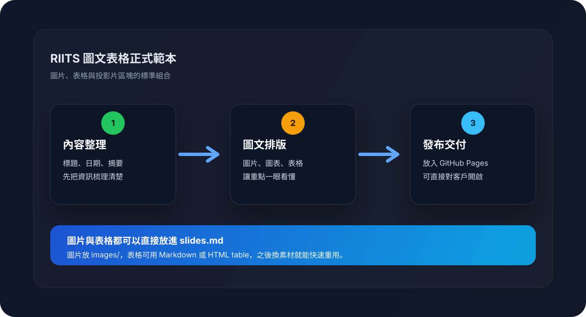

# RIITS 圖文表格正式範本

日期：2026-06-04  
客戶：RIITS  
主題：圖文表格正式範本

---

## 1. 簡報總覽

- 這份 deck 示範正式簡報的標準格式
- 你後續只要替換標題、日期、圖文與表格，就能快速生成同類型內容
- 這個範本同時示範圖片引用與表格排版

--

### 1.1 使用說明

- 圖片放在同資料夾的 `images/`
- 其他附件放在同資料夾的 `assets/`
- 表格可用 Markdown table，較複雜時可直接改成 HTML table

---

## 2. 視覺示意

下方這張圖可以直接換成你的流程圖、產品示意圖或客戶現場照片。

---

## 3. 資料表格範例

以下示範一個可直接改成客戶報價、專案進度或待辦清單的表格。

<table style="width:100%; border-collapse: collapse; margin-top: 18px; font-size: 0.85em;">
  <thead>
    <tr>
      <th style="padding: 12px 14px; border: 1px solid #6b7280; background: #1f2937; color: #fff;">項目</th>
      <th style="padding: 12px 14px; border: 1px solid #6b7280; background: #1f2937; color: #fff;">內容</th>
      <th style="padding: 12px 14px; border: 1px solid #6b7280; background: #1f2937; color: #fff;">備註</th>
    </tr>
  </thead>
  <tbody>
    <tr>
      <td style="padding: 12px 14px; border: 1px solid #6b7280;">主題</td>
      <td style="padding: 12px 14px; border: 1px solid #6b7280;">客戶簡報正式範本</td>
      <td style="padding: 12px 14px; border: 1px solid #6b7280;">可直接複製改寫</td>
    </tr>
    <tr>
      <td style="padding: 12px 14px; border: 1px solid #6b7280;">圖片</td>
      <td style="padding: 12px 14px; border: 1px solid #6b7280;">./images/workflow.svg</td>
      <td style="padding: 12px 14px; border: 1px solid #6b7280;">可換成 PNG/JPG/SVG</td>
    </tr>
    <tr>
      <td style="padding: 12px 14px; border: 1px solid #6b7280;">表格</td>
      <td style="padding: 12px 14px; border: 1px solid #6b7280;">Markdown 或 HTML</td>
      <td style="padding: 12px 14px; border: 1px solid #6b7280;">複雜版面建議用 HTML</td>
    </tr>
  </tbody>
</table>

---

## 4. 可以直接替換的內容區

### 4.1 客戶現況

- 目前狀態
- 已完成事項
- 尚待確認事項

--

### 4.2 下一步

1. 替換圖片
2. 更新表格
3. 調整投影片順序
4. 發佈到 GitHub Pages
